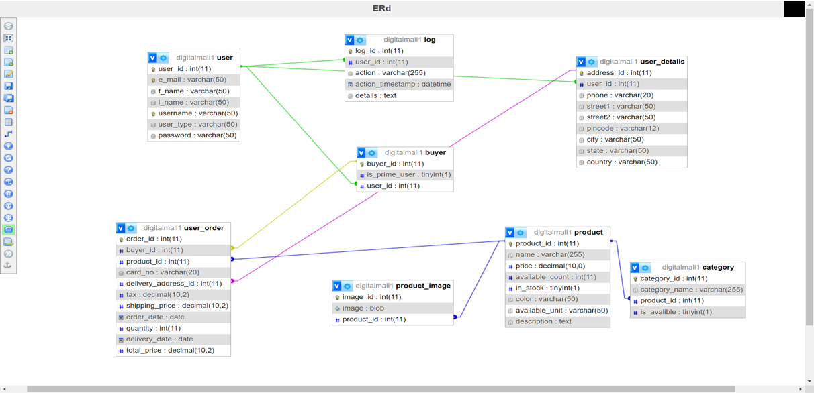

# E-commerce Database Setup

This project contains SQL scripts to create and manage an e-commerce database with essential operations like product management, user accounts, orders, and logs. The dump includes stored procedures for handling key business logic and maintaining a clean structure for data operations.

## Prerequisites

Before setting up the database, ensure you have the following installed:

- **MariaDB** (Version: 10.4.32 or higher)
- **phpMyAdmin** (Optional, Version: 5.2.1 or higher)
- **PHP** (Version: 8.2.12 or higher)

## Class-Diagram

## Database Structure

The database contains several tables designed for managing an e-commerce platform, including users, products, categories, and logs. Key tables are:

- **buyer**: Stores information about buyers, including their prime status.
- **category**: Contains categories for products.
- **product**: Stores product details like name, price, and availability.
- **user**: Contains user account information.
- **log**: Tracks actions performed by users.

## Relationships

- **user** → **buyer**: One-to-one relationship, where each user can become a buyer.
- **product** → **category**: One-to-many relationship, each product can be assigned to a category.
- **user_order**: Links buyers, products, and their associated delivery details.

## Key Stored Procedures

The database includes several stored procedures to manage common operations:

- `addCategoryAndLog`: Adds a new category and logs the action.
- `AddOrUpdateCategory`: Updates a category if it exists or inserts a new category if not found.
- `addUD`: Inserts user details (address, phone, etc.).
- `createAccount`: Creates a new user account and logs the action.
- `delete_category`: Deletes a category by its name and logs the deletion.
- `delete_product`: Deletes a product and logs the action.
- `InsertProduct`: Inserts a new product into the database.
- `login`: Handles user login attempts and logs successful or failed attempts.
- `orderHistory`: Retrieves the order history for a user.
- `purchaseInfo`: Handles the purchase process for a product.
- `SetUserPrime`: Marks a user as a prime member.
- `UpdateProduct`: Updates product details.

## Auto-Increment Fields

Ensure auto-increment fields are properly set for:

- `buyer.buyer_id`
- `category.category_id`
- `log.log_id`
- `product.product_id`
- `user.user_id`
- `user_details.address_id`
- `user_order.order_id`

## Constraints and Foreign Keys

The tables include foreign key constraints to maintain referential integrity:

- `buyer.user_id` → `user.user_id`
- `category.product_id` → `product.product_id`
- `log.user_id` → `user.user_id`
- `product_image.product_id` → `product.product_id`
- `user_details.user_id` → `user.user_id`
- `user_order.buyer_id` → `buyer.buyer_id`
- `user_order.product_id` → `product.product_id`
- `user_order.delivery_address_id` → `user_details.address_id`
